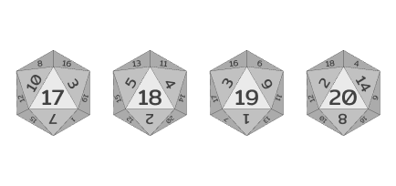

# DiceRollImageGenerator
This was developed with the intention to be later integrated into a DnD oriented discord bot. The idea being that a developer simply needs to pass a list of generated integers and a valid DnD die value [2, 4, 6, 8, 10, 12, 20] to produce an image representing rolled die values and a calculated total. Currently, only up to four passed roll values are supported.

All default die assets were designed in Figma and are free to use. For the purposes of this program, die assets meet a tailored naming scheme (i.e. D6_1.png) and are 96x96px. Ideally, custom die assets can be implemented simply by replacing the existing assets with new 96x96 images.

## Package Requirements
[Pillow(Fork)](https://pillow.readthedocs.io/en/stable/installation.html) - recommended to run in a [virtual environment(venv)](https://docs.python.org/3/library/venv.html)

## Concept Image
### Sample image representing a fully incorporated version of the program into discord:

## Generated Samples
### Sample D4 image:

### Sample D6 image:

### Sample D8 image:

### Sample D10 image:

### Sample D12 image:

### Sample D20 image:

